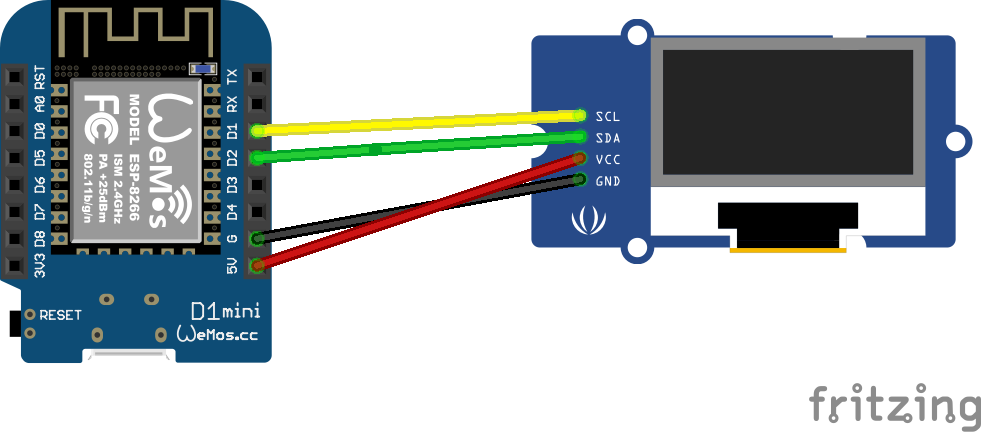

# Table of contents

* [Flask Web Server](#flask-web-server)
* [ESP8266 - OLED I2C](#esp8266-oled-i2c)
* [ESP8266-GET Request to Heroku](#esp8266-get-request-to-heroku)

Flask Web Server
============

## Deploy a Web Server on Heroku with Flask

### Creating a virtual environment for Flask requirements

- Create a directory with the name you want
- Then open the cmd and print 
```
 virtualenv venv
```
- If you are using Windows you can activate the virtual environment with that command
```
venv\Scripts\activate.bat
```
### Installing Libraries
- Now you have to insall Flask, Flask-RESTful and gunicorn for server
```
pip install Flask
pip install flask-restful
pip install gunicorn
```
- One more libraries for Flask Core
```
pip install Flask-Cors
```
### Creating a Flask App
- Then create a main.py file, copy the code below and paste in it.
```python
from flask import Flask, jsonify
from flask_restful import Resource, Api
from flask_cors import CORS

app = Flask(__name__)
api = Api(app)
CORS(app)

questions = {"questions":"Turkiyenin en buyuk dagi?","answers":'Agri Dagi'}

class status (Resource):
    def get(self):
        try:
            return {'data': 'Api is Running'}
        except:
            return {'data': 'An Error Occurred during fetching Api'}

class Questions(Resource):
    def get(self):
        return jsonify(questions)


api.add_resource(status, '/')

api.add_resource(Questions, '/questions/')

if __name__ == '__main__':
    app.run()
```
- Before deploying the project in Heroku we have to create some folders for dependecies
- Create a file with name Procfile and copy the code below and paste it
```
web: gunicorn  main:app
```
- Create runtime.txt and write which python version you are using in it, in my app I'm using python 3.9.7
```
python-3.9.7
```
- Now we have to define requirements, open the terminal in project file and write the code below
```
pip freeze > requirements.txt
```
## Heroku
- Firstly you have to install Heroku CLI, you can follow that link to install Heroku CLI : https://devcenter.heroku.com/articles/heroku-cli
- Then you have to install git on your system, you can follow the link : https://git-scm.com/
- Then after, open the terminal in project file then copy the codes below one by one
```
heroku login
```
- You can change the play-Ard section with whatever you want
```
heroku create play-Ard --buildpack heroku/python
```
- Then, initialize the git
```
git init
```
```
git add .
```
```
git commit -m "Flask-playArd"
```
```
heroku git:remote -a play-Ard
```
- If you come here with no error, we can finally deploy our project to Heroku 
```
git push heroku master
```
- This project live in https://play-ard.herokuapp.com/questions/, you can visit

ESP8266-OLED I2C
============
- Wiring OLED and ESP8266


ESP8266-GET Request to Heroku
============

- Copy the code below and upload to ESP8266

```arduino
#include <SPI.h>
#include <Wire.h>
#include <Adafruit_GFX.h>
#include <Adafruit_SSD1306.h>

// Declaration for SSD1306 display connected using software I2C (default case):
#define SCREEN_WIDTH 128  
#define SCREEN_HEIGHT 64  
#define OLED_RESET -1     //- if your screen has no reset pin, you have to change that value to -1

// Wifi and HTTP libraries
#include <ESP8266WiFi.h>
#include <ESP8266HTTPClient.h>
#include <WiFiClient.h>

#include <ArduinoJson.h>  // to parse the resulting data.

const char* ssid = "WiFi_ssid";
const char* password = "WiFi_password";

HTTPClient http;

Adafruit_SSD1306 display(SCREEN_WIDTH, SCREEN_HEIGHT, &Wire, OLED_RESET);
#define SCREEN_ADDRESS 0x3C

void setup() {

  display.begin(SSD1306_SWITCHCAPVCC, SCREEN_ADDRESS);
  display.clearDisplay();

  Serial.begin(115200);
  WiFi.begin(ssid, password);

  while (WiFi.status() != WL_CONNECTED) {
    delay(1000);
    Serial.print("Connecting..");}
}
void loop() {

  if (WiFi.status() == WL_CONNECTED) { //Check WiFi connection status

     WiFiClient client;
     HTTPClient http;

    http.begin(client, "http://play-ard.herokuapp.com/questions/");  //Specify request destination
    int httpCode = http.GET();                                  //Send the request

    if (httpCode > 0) { //Check the returning code

        DynamicJsonDocument doc(400); //For ESP32/ESP8266 you'll mainly use dynamic.
        DeserializationError error = deserializeJson(doc, client);
        String json = http.getString();
        if (!error) {
          String question = doc["questions"]; 
          String answer = doc["answers"]; 

          display.clearDisplay();
          display.setTextSize(1);
          display.setTextColor(WHITE);
          display.setCursor(0, 10);
          display.println("--------");
          display.println(question);
          display.println("--------");
          display.println(answer);
          display.display();

          Serial.print("------");
          Serial.print(question);
          Serial.print(answer);
          Serial.print("------");
          
          
  } else {
    Serial.print(F("deserializeJson() failed: "));
    Serial.println(error.f_str());
    return;
  }
         //Get the request response payload
    }
    http.end();   //Close connection
  }
  delay(1000);    //Send a request every 30 seconds
}
```
